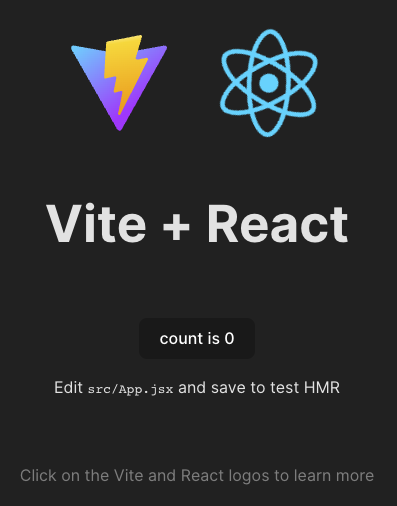
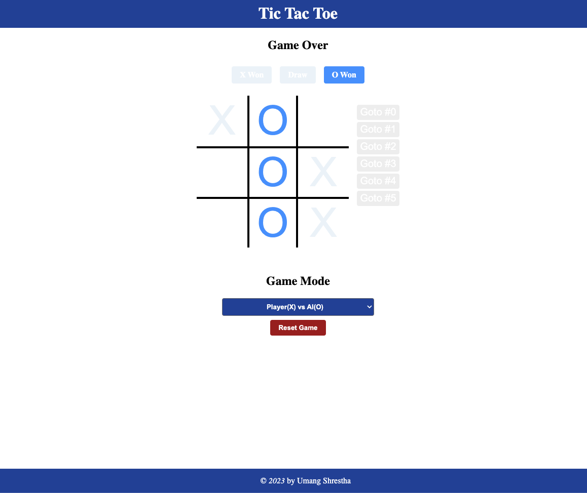

#  Installing Dependencies
```/bin/bash
$ npm create vite@latest --template tic-tac-toe -- --template react
$ cd tic-tac-toe
$ npm install
$ npm run dev
```

If every thing works good you can go http://localhost:5174/ in browser and see:




We will use storybook to view the components individually


# Installing other dependencies
```/bin/bash
$ npm install --save react-redux @types/react-redux @reduxjs/toolkit 
```


